## 多机覆盖路径规划算法 Multi-Agent Coverage Path Planning Algorithm

### 整体思路 Overall  


将多机问题转化为单机问题，每个个体（无人机/UAV）覆盖式扫描每个划分好的地图，最后合并每个地图下的路径规划，完成多机协同覆盖搜索。

每个划分地图都包含一个个体在内，因此有多种划分方式，这里的区域划分算法效果可能有初阶、中阶和高阶之分。理想情况下，覆盖所有的地图划分需要尽可能地均匀分配地图，以确保总时长最少。更高阶的区域划分需要考虑到空间的连通性和每个区间的步数，划分出更加合理的区间。

Transforming the multi-agent problem into a single-agent problem, where each agent (UAV) conducts coverage scanning over individually partitioned maps. Finally, the path planning for each map is merged to achieve collaborative multi-agent coverage search.

Each partitioned map includes one agent, giving rise to multiple partitioning approaches. The quality of the area partitioning algorithm can be categorized as basic, intermediate, or advanced. Ideally, achieving an even distribution of maps for coverage is essential to minimize the overall time. Advanced area partitioning methods consider spatial connectivity and the number of steps in each partition to create more rational divisions.

单机路径规划算法（启发式）Single-Agent Path Planning Algorithm (Heuristic):


**原理**：基于启发式搜索的覆盖路径规划算法，结合覆盖搜索和A*搜索，实现高效的区域覆盖。

**步骤**：
1. 从起始点开始，使用覆盖搜索算法进行区域覆盖
2. 当无法继续覆盖时，使用A*搜索找到最近的未访问区域
3. 重复上述过程，直到完成整个区域的覆盖

**启发式函数**：
- **曼哈顿距离（MANHATTAN）**：
  $$ h(x, y) = |x - x_g| + |y - y_g| $$
- **切比雪夫距离（CHEBYSHEV）**：
  $$ h(x, y) = \max(|x - x_g|, |y - y_g|) $$
- **垂直启发式（VERTICAL）**：
  $$ h(x, y) = |y - y_g| $$
- **水平启发式（HORIZONTAL）**：
  $$ h(x, y) = |x - x_g| $$

其中，\( (x, y) \) 是当前位置，\( (x_g, y_g) \) 是目标位置。

**A*搜索算法**：
A*算法的代价函数为：
$$ f(n) = g(n) + h(n) $$
其中，$ g(n) $ 是从起始点到当前节点的实际代价，$ h(n) $ 是从当前节点到目标节点的启发式估计代价。

### 区域划分算法 Region Partitioning Algorithms

#### 初阶区域划分算法 Basic Region Partitioning Algorithm

**原理**：基于网格的均匀划分算法，根据地图的长和宽自动选择划分方向（按行或按列），将地图均匀划分为指定数量的子区域。

**步骤**：
1. 分析地图尺寸，决定按行或按列划分
2. 计算每个子区域的大小，分配剩余行/列
3. 提取子区域并计算面积
4. 为每个子区域在边界处添加起始点

**特点**：
- 实现简单，计算效率高
- 划分结果规则，易于理解
- 适用于障碍物分布均匀的地图

#### 高阶区域划分算法 Advanced Region Partitioning Algorithm

**原理**：考虑空间连通性和负载均衡的智能划分算法，基于图论和贪心策略实现。

**步骤**：
1. 识别地图中的连通区域（使用BFS算法）
2. 估计每个连通区域的覆盖步数
3. 分割大的连通区域以满足智能体数量要求
4. 基于贪心算法分配连通区域，实现负载均衡
5. 为每个子区域添加起始点

**覆盖步数估计**：
对于一个连通区域，覆盖步数估计公式为：
$$ S = \alpha \times A + \beta \times P $$
其中，
-  A  是区域面积（可通行单元格数量）
-  P  是区域周长
-  \alpha  和  \beta  是权重系数

**负载均衡目标**：
最小化智能体之间的最大覆盖步数差异：
$$ \min \max_{i,j} |S_i - S_j| $$
其中， S_i  是智能体  i  的覆盖步数。

**贪心分配策略**：
1. 按面积降序排序连通区域
2. 将每个区域分配给当前负载最小的智能体
3. 重复直到所有区域分配完毕

**特点**：
- 考虑空间连通性，确保每个子区域是连通的
- 基于覆盖步数进行负载均衡，提高多机协同效率
- 适用于复杂障碍物分布的地图

### 转译层 Translation Layer

**功能**：
1. **地图格式转换**：普通地图与01地图互转
2. **坐标转译**：子地图坐标与总图坐标互转
3. **多机路径可视化**：在总图上展示多机协同覆盖路径

**应用**：
- 支持不同格式地图的处理
- 确保多机路径在总图上的正确显示
- 提供直观的多机协同效果展示

### 已实现算法 Implemented Algorithms

- [x] 单机路径规划算法（启发式）Single-Agent Path Planning Algorithm (Heuristic)
- [x] 初阶区域划分算法 Basic Region Partitioning Algorithm
- [x] 高阶区域划分算法 Advanced Region Partitioning Algorithm
- [x] 转译层（①普通地图与01地图互转；②划分后01地图对应至总图位置坐标转译）Translation layer ( ①Common map and 01 map intertransfer; ② After division 01 map corresponds to the general map position coordinate translation )

### 安装和使用 Installation & Usage
```bash
conda create -n CoPath python=3.8
conda activate CoPath
pip install -r requirements.txt
```

#### 运行单机路径规划示例
```bash
python main.py
# 选择选项 1
```

#### 运行多机覆盖路径规划示例
```bash
python main.py
# 选择选项 2
# 选择区域划分算法（1. 初阶/2. 高阶）
# 输入智能体数量（2-4）
```

#### 运行测试脚本
```bash
# 测试区域划分算法
python test_partition.py

# 测试转译层功能
python test_translation.py

# 运行集成测试
python test_integration.py
```

### 现有函数说明 Existing function specification

#### PathPlanningCore 算法核心层
- CoveragePlanner 类：实现单机覆盖路径规划的核心算法

#### getPath 算法解算层
```python
def plan_coverage_path(maps: list, isprint=True, isconsole=True ,test_show_each_result=False) -> list:
    """
    覆盖路径规划算法生成函数

    :param maps: (map_name_list) 输入已有的map(npy)格式数据文件名；
    :param isprint: (默认为True) 是否输出图示；
    :param isconsole:  (默认为True) 是否控制台打印信息；
    :param test_show_each_result: (默认为False) 是否显示每个结果的测试标志；
    :return: best_trajectory_list: 最好的路径列表

    {
        "map_name": 地图文件名,

        "start_pos": 起始位置,

        "end_pos": 结束位置,

        "start_orientation": 初始方向 ['^', '<', 'v', '>'],

        "start_orientation_code": 初始方向代码 [0, 1, 2, 3],

        "coverage_path_Heuristic": 启发式算法名称（MANHATTAN曼哈顿距离；CHEBYSHEV切比雪夫距离；VERTICAL垂直启发式；HORIZONTAL水平启发式,

        "Path_point_list": 路径点列表 ([row_id, column_id]),

        "Cost": 总代价,

        "Steps": 总步长,

        "policy_map": 策略地图
    }
    """
```

#### mapTools 地图工具
```python
def gen_base_map(rows=16, cols=19, obstacle_size=2):
    '''
    生成基础的数组地图，可以手动调整障碍后调用map2np生成持久储存使用的npy地图

    :param rows: 行数 (空格为0)
    :param cols: 列数 (空格为0)
    :param obstacle_size: 障碍尺寸 (障碍默认2X2大小，为1)
    :return: grid: 生成的map数组
    '''

def random_obstacle_map(rows=10, cols=12):
    '''
    生成随机障碍地图

    :param rows: 行数 (空格为0)
    :param cols: 列数 (空格为0)
    :return: grid: 生成的map数组
    '''

def randomStartPoint(input_map: list, startpoint=1):
    '''
    随机生成起始点 (置为2) 加入到地图中(随机四周放点，四周所有的[0][0]和首行[0]与尾行[-1])

    :param input_map: 输入的地图
    :param startpoint: 起始点数量，默认为1（一次规划只能规划最开始的起始点），划分后可以进行多个
    :return: new_map: 含随机起始点的新地图
    '''

def map2np(maps: list, map_name_list: list):
    '''
    将数组地图转换成持久储存使用的npy地图

    :param maps: 地图数据列表 (嵌套数组)
    :param map_name_list: 地图名字列表 (也是保存的文件名maps/map_name.npy)
    :return: None
    '''

# 区域划分算法

def basic_region_partition(input_map: list, num_regions: int):
    '''
    初阶区域划分算法，将地图均匀划分为指定数量的子区域

    :param input_map: 输入的地图
    :param num_regions: 要划分的区域数量
    :return: regions: 划分后的子区域列表，每个子区域包含地图数据和边界信息
    '''

def advanced_region_partition(input_map: list, num_regions: int):
    '''
    高阶区域划分算法，考虑空间连通性和负载均衡

    :param input_map: 输入的地图
    :param num_regions: 要划分的区域数量
    :return: regions: 划分后的子区域列表，每个子区域包含地图数据和边界信息
    '''

# 高阶区域划分算法辅助函数

def split_large_region(region, num_subregions):
    '''
    分割大的连通区域为多个子区域

    :param region: 要分割的连通区域
    :param num_subregions: 子区域数量
    :return: 分割后的子区域列表
    '''

def identify_connected_regions(map_array):
    '''
    识别地图中的连通区域

    :param map_array: 地图数组
    :return: 连通区域列表，每个区域包含细胞列表和面积
    '''

def estimate_coverage_steps(cells):
    '''
    估计覆盖区域所需的步数

    :param cells: 区域中的细胞列表
    :return: 估计的步数
    '''

def assign_regions(connected_regions, num_regions):
    '''
    基于贪心算法分配连通区域给不同的智能体

    :param connected_regions: 连通区域列表
    :param num_regions: 智能体数量
    :return: 分配给每个智能体的区域
    '''

# 转译层函数

def map_to_binary(map_array):
    '''
    将普通地图转换为01地图
    0: 可通行区域
    1: 障碍物

    :param map_array: 普通地图数组
    :return: 01地图数组
    '''

def binary_to_map(binary_map, start_positions=None):
    '''
    将01地图转换为普通地图
    0: 可通行区域
    1: 障碍物
    2: 起始点

    :param binary_map: 01地图数组
    :param start_positions: 起始点位置列表，默认为None
    :return: 普通地图数组
    '''

def submap_to_global_coords(submap_coords, region_bounds):
    '''
    将子地图坐标转换为总图坐标

    :param submap_coords: 子地图中的坐标 (row, col)
    :param region_bounds: 区域边界 (start_row, start_col, end_row, end_col)
    :return: 总图中的坐标 (row, col)
    '''

def global_to_submap_coords(global_coords, region_bounds):
    '''
    将总图坐标转换为子地图坐标

    :param global_coords: 总图中的坐标 (row, col)
    :param region_bounds: 区域边界 (start_row, start_col, end_row, end_col)
    :return: 子地图中的坐标 (row, col)
    '''

def visualize_multi_agent_path(original_map, regions, paths, title="多机覆盖路径"):
    '''
    在总图上可视化多机协同覆盖路径

    :param original_map: 原始地图
    :param regions: 划分后的区域列表
    :param paths: 各区域的路径列表
    :param title: 标题
    '''
```

### 效果展示 Results

#### 基础地图
基础地图[Base_map]  


修改后基础地图[Test_map]  


随机障碍地图[Random_obstacle_map]  


#### 初阶区域划分结果
基础地图划分（2区域）  
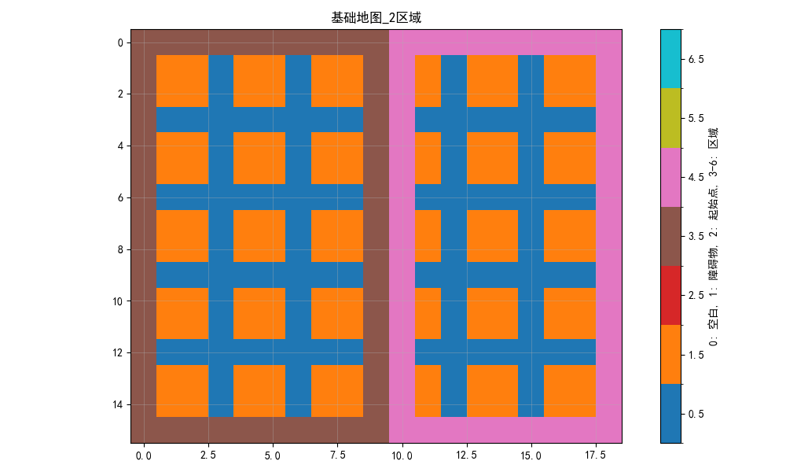

基础地图划分（3区域）  
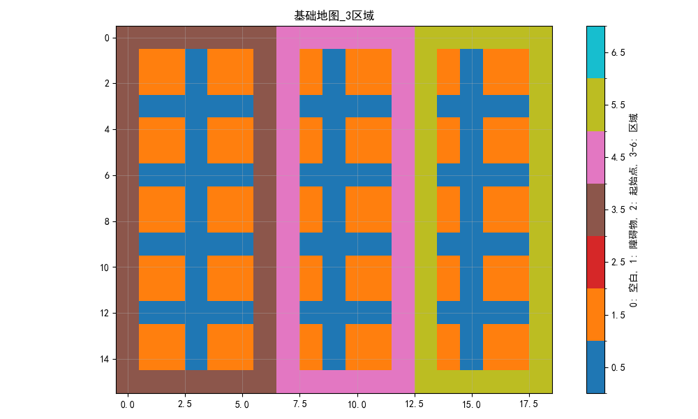

基础地图划分（4区域）  
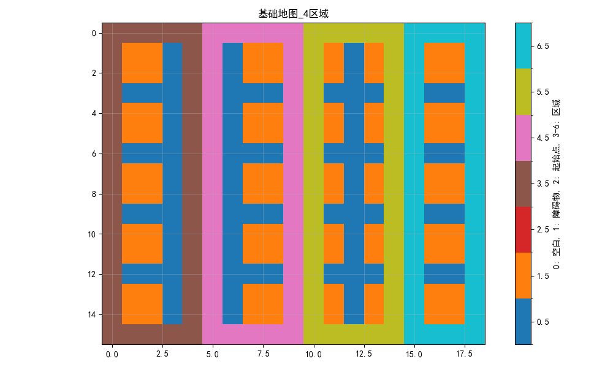

随机障碍地图划分（2区域）  
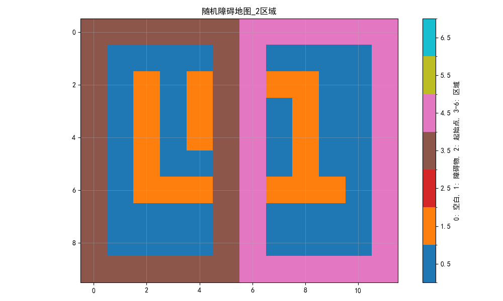

随机障碍地图划分（3区域）  
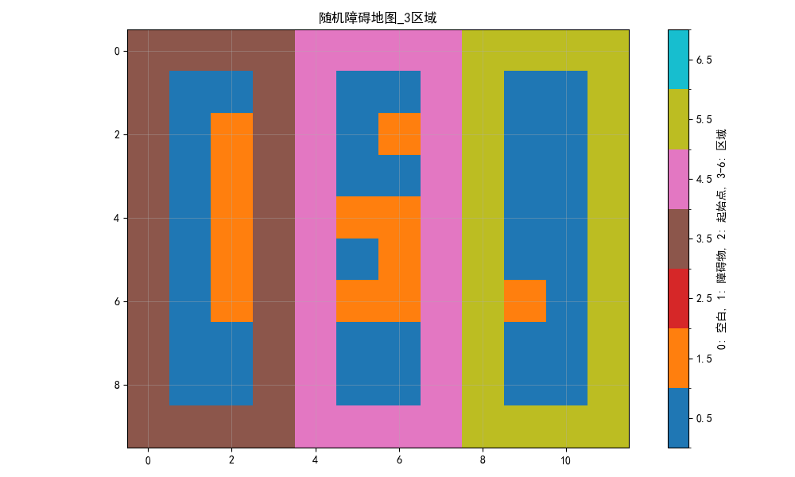

随机障碍地图划分（4区域）  
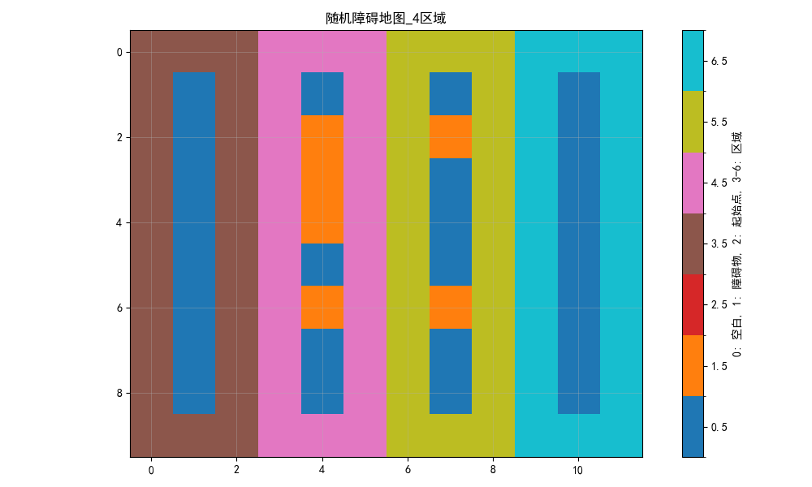

#### 高阶区域划分结果
高级划分-基础地图（2区域）  
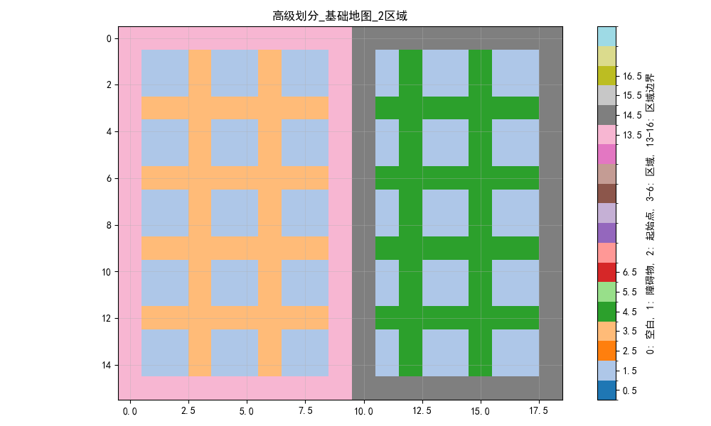

高级划分-基础地图（3区域）  
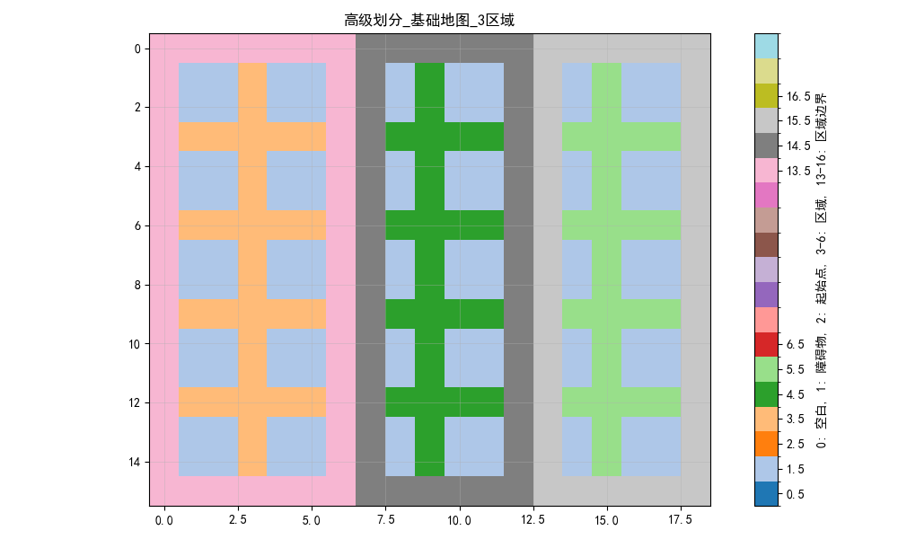

高级划分-基础地图（4区域）  
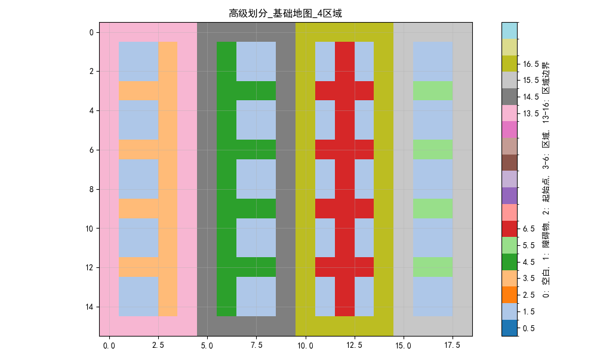

高级划分-随机障碍地图（2区域）  
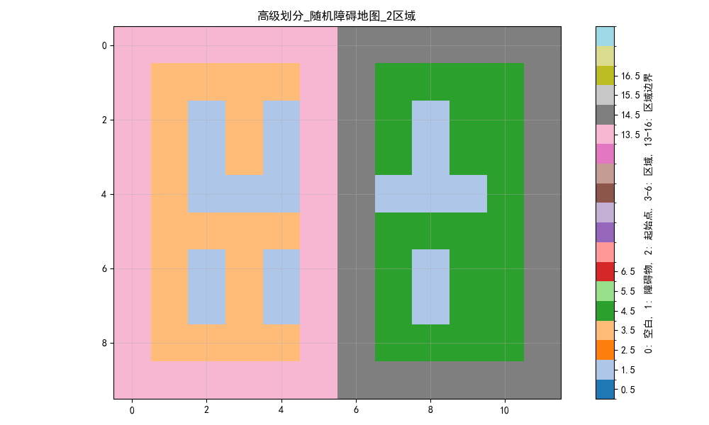

高级划分-随机障碍地图（3区域）  
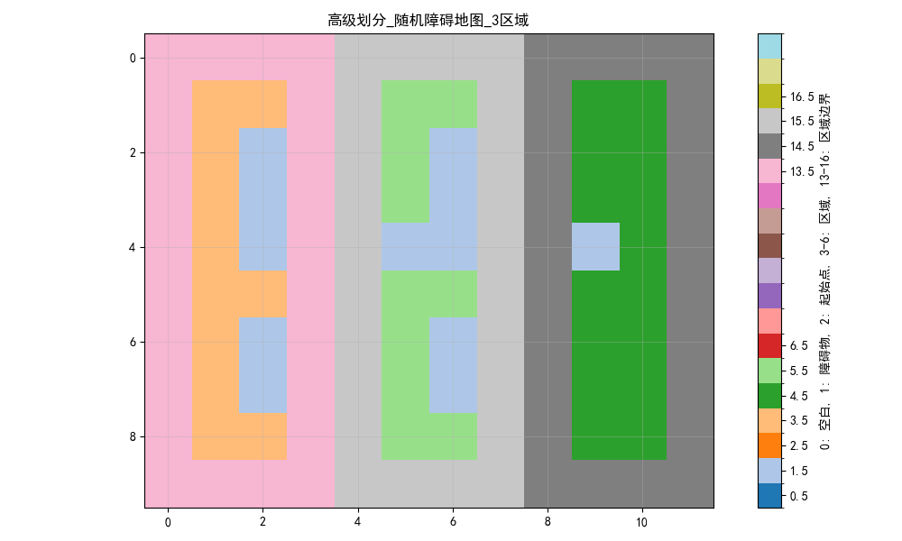

高级划分-随机障碍地图（4区域）  
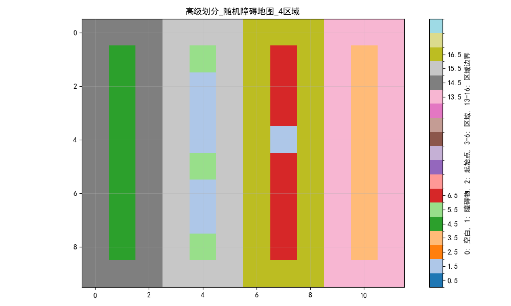

#### 多机覆盖路径规划结果
多机覆盖路径测试  
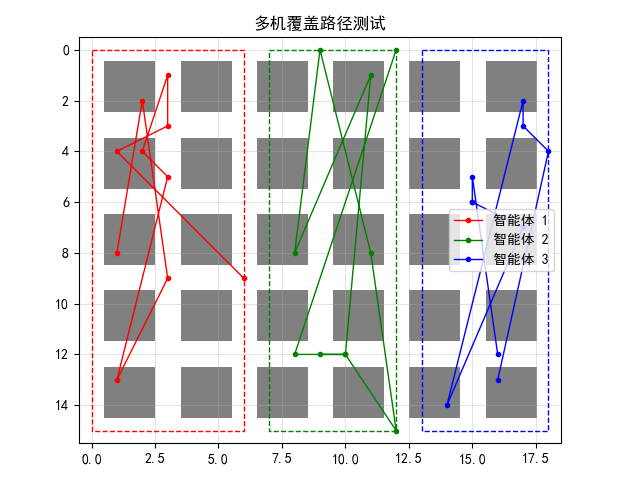

多机覆盖路径规划（3智能体）  
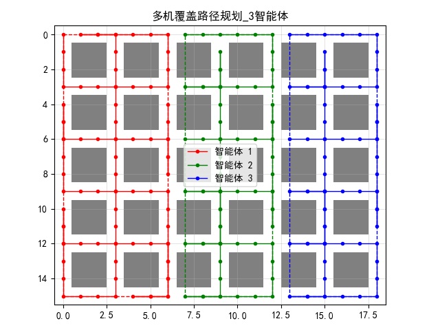
